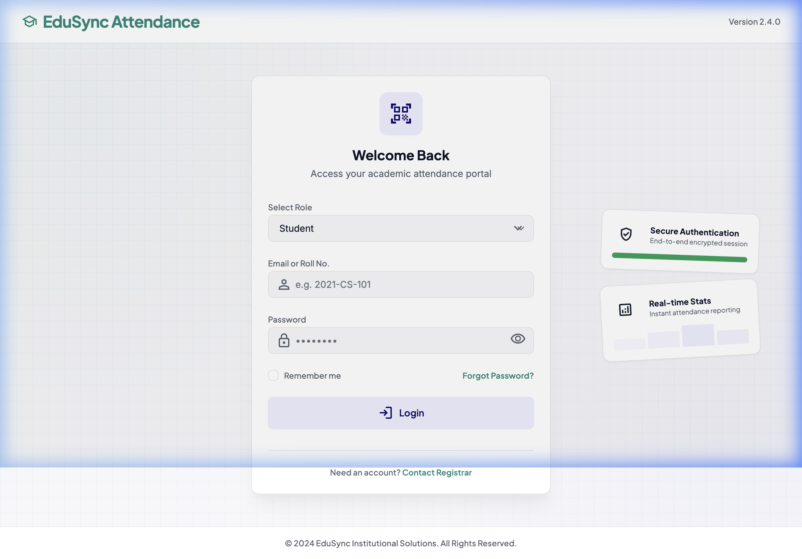
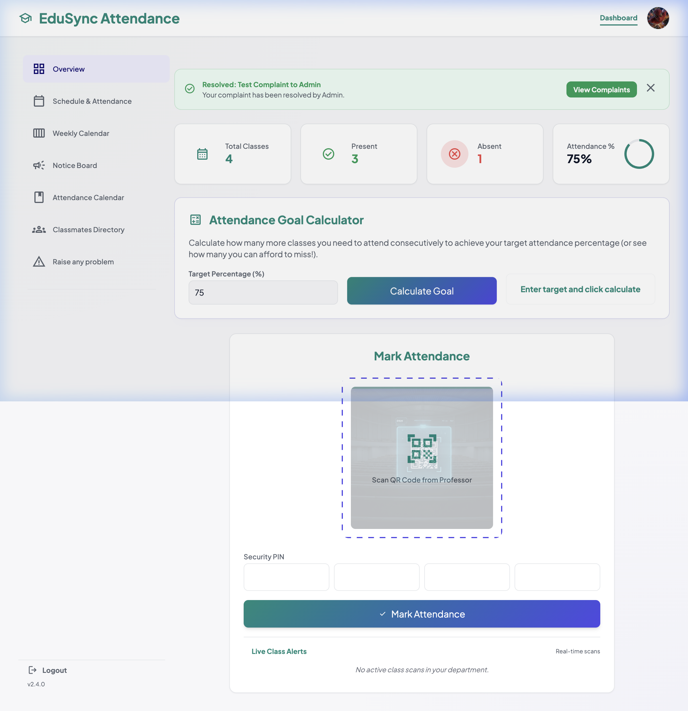
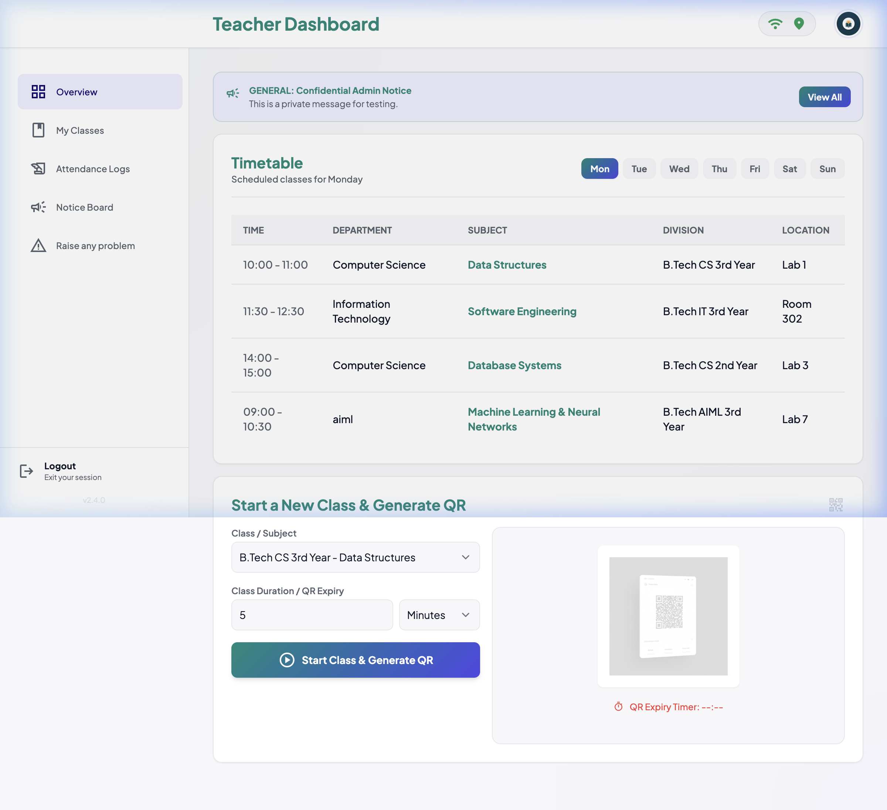
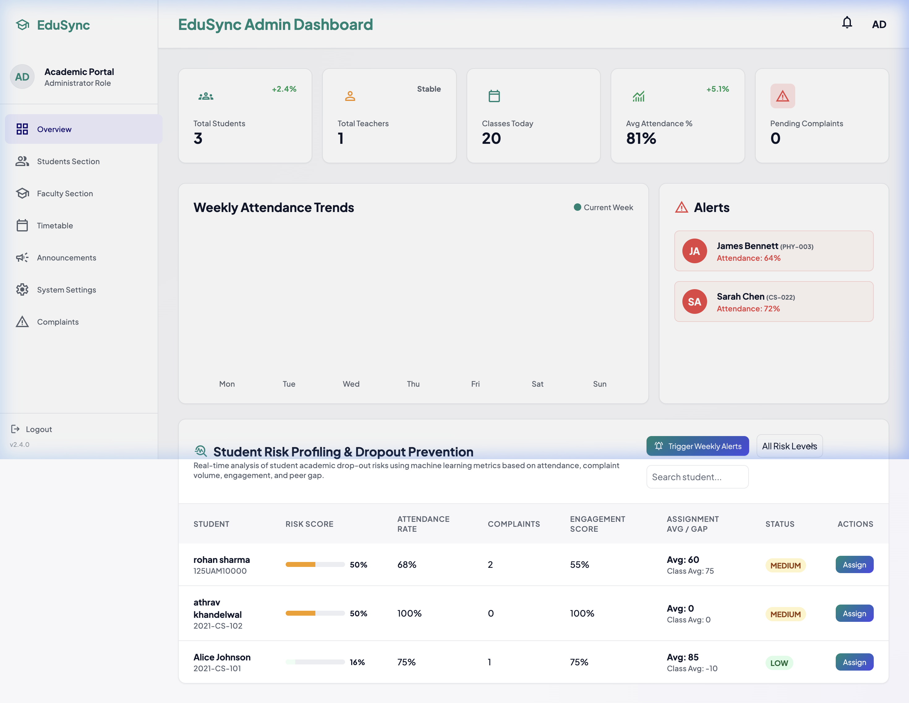

# EduSync - Attendance Management System 🎓

EduSync ek modern, beautiful, aur responsive **Attendance Management System** hai jise HTML, Tailwind CSS (Custom HSL System), Node.js, Express, aur MongoDB ke sath banaya gaya hai. Yeh application Student, Teacher, aur Admin portals ko complete interactive dashboards ke sath handle karti hai.

---

## 🚀 Features

### 👨‍🎓 Student Portal
- **Overview Dashboard**: Present/Absent percentage rings aur dynamic statistics.
- **Attendance Calendar**: Logged dates aur dynamic status markers (Present, Absent, Leave, Pending).
- **Interactive Schedule**: Direct subject classes details aur status views.
- **Classmates Directory**: Real-time classmates list with search/filter features.
- **Complaints System**: Dynamic complaint filing, listing, and tracking status.

### 👩‍🏫 Teacher Portal
- **Mark Attendance**: Subject-wise dynamic attendance submission screen.
- **Student Performance**: Student profiles aur individual risk factors calculation.
- **Notices System**: Quick updates publish karne ka portal.

### 🔑 Admin Portal
- **Dashboard Overview**: Overall system details, active logs.
- **Users Management**: Student/Teacher creation, updates, and CSV imports.
- **Analytics & Logs**: System tracking and security operations.

---

## 📸 Screenshots

### 🔐 Login Screen


### 👨‍🎓 Student Dashboard


### 👩‍🏫 Teacher Dashboard


### 🔑 Admin Dashboard


---


## 🛠️ Technology Stack

- **Frontend**: Vanilla HTML5, CSS3, Tailwind CSS (Interactive HSL theme customization)
- **Backend**: Node.js, Express.js
- **Database**: MongoDB (Mongoose ODM)
- **Authentication**: JWT (JSON Web Tokens) with Secure HTTP-Only Cookies

---

## 💻 Local Installation & Setup

1. **Repository Clone karein:**
   ```bash
   git clone <repository-url>
   cd attendance-system
   ```

2. **Dependencies Install karein:**
   ```bash
   npm install
   ```

3. **Environment Variables (`.env`) Setup karein:**
   Project root directory me ek `.env` file banayein:
   ```env
   PORT=5001
   MONGODB_URI=mongodb://localhost:27017/edusync
   JWT_SECRET=your_super_secret_jwt_key
   ```

4. **Seed Database (Optional):**
   Database me initial demo data add karne ke liye:
   ```bash
   node seed.js
   node seed_classes.js
   ```

5. **Start the Application:**
   ```bash
   npm start
   ```
   Open [http://localhost:5001](http://localhost:5001) in your browser.

---

## 🌐 Public Deployment (Render & MongoDB Atlas)

### Step 1: Cloud Database Setup (MongoDB Atlas)
1. **MongoDB Atlas** par free account banayein.
2. Naya Shared Cluster create karein.
3. Network Access me `0.0.0.0/0` IP whitelist karein.
4. Connection string (URI) copy karein aur use `.env` me `MONGODB_URI` ke aage replace karein.

### Step 2: Push to GitHub
Apne project directory me git repository initialize karke GitHub par push karein:
```bash
git init
git add .
git commit -m "Initial commit with deployment config"
git branch -M main
git remote add origin <your-github-repo-url>
git push -u origin main
```

### Step 3: Deploy to Render
1. **Render.com** par login karein.
2. **New Web Service** select karke apni repository connect karein.
3. Niche di gayi configuration set karein:
   - **Build Command**: `npm install`
   - **Start Command**: `node server.js`
4. **Environment Variables** me click karke `.env` ki sabhi keys (`MONGODB_URI`, `JWT_SECRET`, etc.) manually set karein.
5. Deploy button press karein! Aapka app public URL par live ho jayega.
